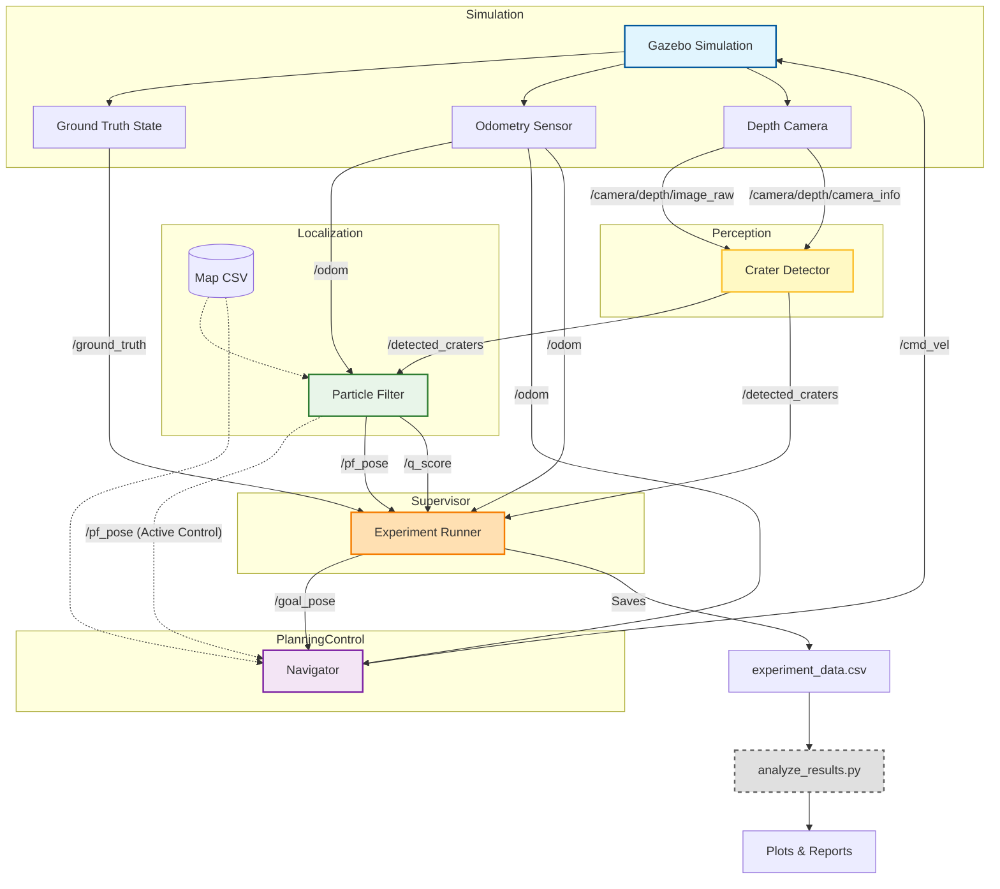

```mermaid
graph TD
    %% Subsystems
    subgraph Simulation
        GZ[Gazebo Simulation]
        GT[Ground Truth State]
        Odom[Odometry Sensor]
        Cam[Depth Camera]
        GZ --> GT
        GZ --> Odom
        GZ --> Cam
    end

    subgraph Perception
        CD[Crater Detector]
        Cam -- /camera/depth/image_raw --> CD
        Cam -- /camera/depth/camera_info --> CD
    end

    subgraph Localization
        PF[Particle Filter]
        MapData[(Map CSV)]
        CD -- /detected_craters --> PF
        Odom -- /odom --> PF
        MapData -.-> PF
    end

    subgraph PlanningControl
        Nav[Navigator]
        MapData -.-> Nav
        Odom -- /odom --> Nav
        PF -. /pf_pose (Active Control) .-> Nav
    end

    subgraph Supervisor
        ER[Experiment Runner]
        GT -- /ground_truth --> ER
        Odom -- /odom --> ER
        PF -- /pf_pose --> ER
        PF -- /q_score --> ER
        CD -- /detected_craters --> ER
        ER -- /goal_pose --> Nav
    end

    %% Actuation
    Nav -- /cmd_vel --> GZ

    %% Logging & Analysis
    ER -- Saves --> CSV[experiment_data.csv]
    CSV --> An[analyze_results.py]
    An --> Plot[Plots & Reports]

    %% Styling
    style GZ fill:#e1f5fe,stroke:#01579b,stroke-width:2px
    style CD fill:#fff9c4,stroke:#fbc02d,stroke-width:2px
    style PF fill:#e8f5e9,stroke:#2e7d32,stroke-width:2px
    style Nav fill:#f3e5f5,stroke:#7b1fa2,stroke-width:2px
    style ER fill:#ffe0b2,stroke:#f57c00,stroke-width:2px
    style An fill:#e0e0e0,stroke:#616161,stroke-width:2px,stroke-dasharray: 5 5
```
